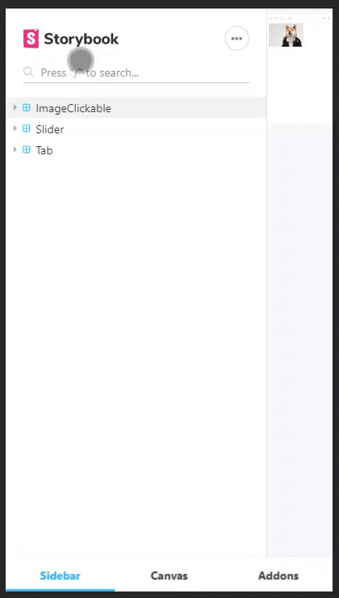

<p align="center">

# Vue.js sleepy-components

##### This is a project containing some of useful components I wrote before for vue.js

[Changelog](https://github.com/hangekinobaka/sleepy-components/releases)

<p align="center">
  
</p>

### Components List
* ImageClickable
> An image compnent with a preview that fits its outer box and a zoom window inside which the user can move and zoom in-and-out the image.
* Slide
> A simlple slider layout, go from left to right.
* Tab
> A simlple tab layout with the basic switch function
  

### Project setup

```bash
npm install
```

### Start
```bash
npm run storybook
```

### Examples

I'll take `Tab` as an example for normal components.
First of all, you need to set up your Vue.js correctly.
  
```javascript
import TabLayout from "@component/TabLayout";
import Tab from "@component/Tab";

/*
The comps like Tab stores an array of itselves inside the TabLayout, 
thus they have to be used together.
*/
```

```vue
<tab-layout>
  <tab label="tab1">this is tab 1</tab>
  <tab label="tab2" :selected="true">this is tab 2</tab>
  <tab label="tab3">this is tab 3</tab>
</tab-layout>`
```  